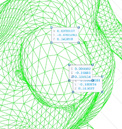
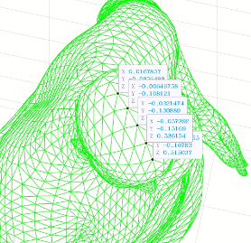

# 学习规划
## 总规划
7.3----7.9
周一：做研究 看开发 写力扣 

这周应该开始重新实战网络开发，可以从一个个小项目积累经验

以及研究也该进一步推动，为了给中期发表腾出时间

## 周一:
1.计算30度头部偏移是否30度    <strong>完成</strong>

15：00 --- 15：30

我记录头部中线方向以此方向为基准进行判断角度依据 

从头后部到前部取五个点

1 (0.0379117,-0.0705285,0.545818)

2 (0.0290094,-0.101616,0.551733)

3 (0.0181541,-0.134174,0.548555)

4 (0.006692,-0.16481,0.536154)

5 (-0.00444081,-0.189874,0.515037)

1 (0.0167857,-0.0856498,0.545818)

2 (-0.00646758,-0.108121,0.551733)

3 (-0.0321474,-0.130889,0.548555)

4 (-0.057392,-0.151169,0.536154)

5 (-0.0795655,-0.16783,0.515037)

### 2.生成大量模拟数据并开始训练

1.对rr参数的第5个数值 (0,z,0)  将度数转化为数值  生成全新的smpl dataset

2.对这个dataset进行生成点群

3.生成模拟数据

4.训练

3.学习下markdown一些用法

